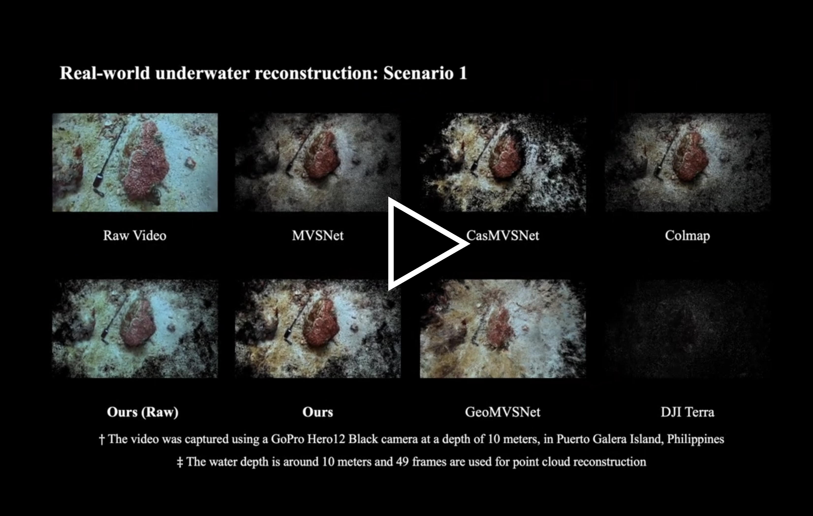

<h1 align="center">Towards End-to-End Underwater Multi-View Stereo for Real-World Dense Scene Reconstruction</h1>

<br />

<div align="center">

<a href="https://www.youtube.com/watch?v=1N-jPW4yNS8&t=1s" target='_blank'></a>

</div>

## 📦 Underwater Multi-View Stereo Dataset

The underwater multi-view stereo (UwMVS) dataset represents the **first large-scale synthetic dataset** that preserves real-world underwater degradation characteristics, specifically designed for end-to-end training and evaluation of learning-based UwMVS methods.

### ✔ Comparison with Existing Underwater Stereo Datasets

| Datasets             | Year | Training Set | Validation Set | Test Set | Multi-View* | Depth Map† | Point Cloud‡ |
|----------------------|------|-------------|---------------|----------|------------|-----------|-------------|
| UWbundle [1]         | 2017 | -           | -             | 36       | ✓          | ✗         | ✓           |
| UwStereoNet [2]      | 2019 | 4,047       | -             | 15       | ✓          | ✗         | ✗           |
| DRUVA [3]            | 2023 | 6,000       | -             | 110      | ✓          | ✗         | ✗           |
| FLSea-Stereo [4]     | 2023 | 7,337       | -             | -        | ✓          | ✗         | ✗           |
| SeaThru-NeRF [5]     | 2023 | 74          | 14            | -        | ✓          | ✗         | ✗           |
| UwStereo [6]         | 2024 | 26,611      | -             | 2,957    | ✗          | ✓         | ✗           |
| **UwMVS (Ours)**     | -    | **108,388** | **24,696**    | **4,312**<br>**28,440** | ✓ | ✓ | ✓ |

#### Notes:
- *: Indicates whether the dataset includes multi-view images.
- †: Specifies if per-view ground-truth metric depth maps are available.
- ‡: Denotes the presence of ground-truth point clouds for each reconstruction scenario.

### ✔ Statistics of the Proposed UwMVS Dataset

| Attributes                          | Training Set | Validation Set | Test Set |
|-------------------------------------|--------------|----------------|----------|
| # of Reconstruction Scenarios       | 79           | 18             | 22       |
| # of Underwater Scene Types         | 4            | 4              | 4        |
| # of Underwater Degradation Levels  | 7            | 7              | 1        |
| # of Images in Total                | 108,388      | 24,696         | 4,312    |
| # of Images for Each Scenario       | 1,372        | 1,372          | 196      |
| Ground-Truth Depth Map              | ✓            | ✓              | -        |
| Ground-Truth Point Cloud            | ✓            | ✓              | ✓        |

#### Notes:
Our UwMVS dataset includes 79, 18, and 22 underwater reconstruction scenarios for training, validation, and testing, respectively. Each scenario consists of 1,372 images for both training and validation, and 196 images for testing. The dataset covers 4 underwater scene types per scenario and incorporates 7 levels of underwater degradation for training and validation to enhance model robustness. The most severe degradation level is reserved for the test set to evaluate the generalization capability of the learning-based UwMVS. In total, the training, validation, and test sets comprise 108,388, 24,696, and 4,312 underwater multi-view images, respectively.

In addition, we provide 21 real-world underwater video sequences with a total duration of 948 seconds, recorded at 30 frames per second, from which up to 28,440 multi-view images can be extracted for evaluating reconstruction performance in real-world underwater scenes.

Our synthesis method generates underwater multi-view images with ground-truth depth maps and point clouds directly obtained from the in-air MVS dataset [DTU](https://roboimagedata.compute.dtu.dk/?page_id=36), thereby eliminating the need for labor-intensive depth annotation and costly underwater laser scanning.

*Acknowledgement*: We extend our sincere gratitude to DTU for their foundational dataset and contributions to the research community.

### ✔ UwMVS Training and Validation Sets

The UwMVS training and validation sets are available [here](https://drive.google.com/drive/folders/1WeVMWnPXDBpB948fbhG6xX7O24Mt-gXf?usp=sharing).
```
UwMVS_Training_Validation
 ├── Cameras
 ├── Depths_raw
 ├── MVS_Data
 ├── Rectified_AIR
 └── Rectified_UW
       ├── Bluish
       ├── Greenish
       ├── Hazy
       └── Lowlight
```
#### Folder Structure

- **`Cameras`**: Contains camera intrinsics, extrinsics, and a view selection pair file.
- **`Depth_raw`**: Stores ground-truth depth maps obtained through depth map rendering.
- **`MVS_Data`**: Includes ground-truth point clouds scanned by a structured-light scanner.
- **`Rectified_AIR`**: Holds terrestrial in-air multi-view images.
- **`Rectified_UW`**: Contains underwater multi-view images across four types of underwater scenes.

### ✔ UwMVS Test Set

The UwMVS test set is available [here](https://drive.google.com/file/d/1qvYtvIKiqpSzLhZGO5mzyJFHsYjWIplC/view?usp=sharing).
```
UwMVS_Test
 ├── Bluish
 ├── Greenish
 ├── Hazy
 └── Lowlight
```
#### Each directory contains:
- **Camera parameters** (intrinsics, extrinsics, and view selection pair file)
- **Underwater multi-view images** organized by reconstruction scenario

### ✔ UwMVS Real-World Test Set

The UwMVS real-world test set is available [here](https://drive.google.com/drive/folders/1TeaEg3Uzq6eEj0VZJSfBkJYNYygpFBA0?usp=sharing).
```
UwMVS_Real_World
 ├── Images
 └── Videos
```
#### Folder Structure

- **`Images`**: Contains real-world underwater multi-view images extracted from videos.
- **`Videos`**: Stores real-world underwater video sequences.
- **Note**: Scenarios 1–18 were recorded in the Red Sea, and Scenarios 19–21 near Puerto Galera Island.

## :ocean: Underwater Multi-View Images Synthesis

### ✔ Underwater Degradation Parameters Estimator
```
python ./Physical_Synthesis/estimator.py
```

### ✔ Underwater Multi-View Images Synthesizer

For synthesizing the training set, run 
```
python ./Physical_Synthesis/synthesize_train.py
```

For synthesizing the validation set, run 

```
python ./Physical_Synthesis/synthesize_val.py
```

For synthesizing the test set, run 
```
python ./Physical_Synthesis/synthesize_test.py
```
## :diving_mask: Underwater Multi-View Stereo

### 📈 Training on UwMVS

#### Modify ``scripts/train.sh``:

* Set ``MVS_TRAINING`` as the path of the UwMVS training set.
* Set ``LOG_DIR`` to save the checkpoints.
* Change ``NGPUS`` to suit your device.
  
```bash
# Path to UwMVS training dataset
MVS_TRAINING="/your/path/to/UwMVS_training_set"

# Checkpoint save directory
LOG_DIR="/your/path/to/checkpoints"

# Number of GPUs (adjust to your hardware)
NGPUS=2
```

#### Configure ``datasets/dtu_yao.py``:
Specify the underwater scene type (e.g., Greenish) by updating the image path:

```python
# Example for Greenish water scene:
img_filename = os.path.join(
    self.datapath,
    'Rectified_UW/Greenish/{}/rect_{:0>3}_{}_r5000.png'.format(scan, vid + 1, light_idx)
)

# Alternative scene types available:
# - Bluish: 'Rectified_UW/Bluish/{}/rect...'
# - Hazy: 'Rectified_UW/Hazy/{}/rect...'
# - Lowlight: 'Rectified_UW/Lowlight/{}/rect...'


